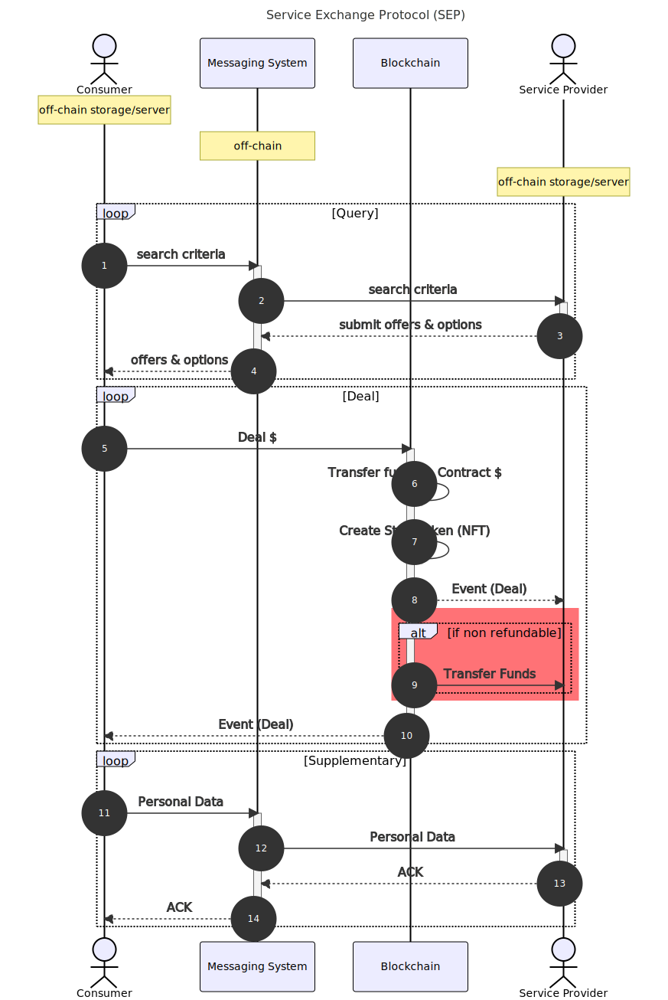

# Process

## Sequence Diagram

## Verification

[Messages](./messaging) exchanged and [data](./storage) stored are verified using an [on-chain](./on-chain) registry of valid service providers. This registry provides:

1. Role-based authentication to verify signers for the service-provider.
2. Document timestamping for data storage.